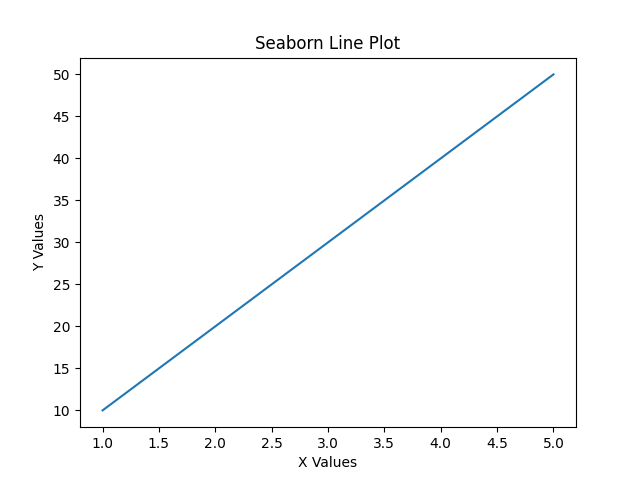
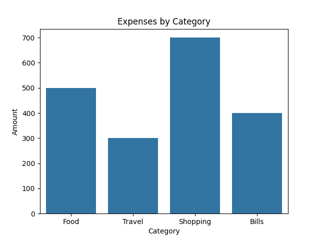
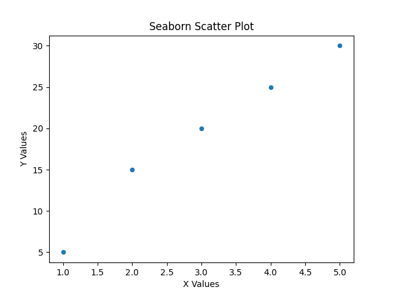
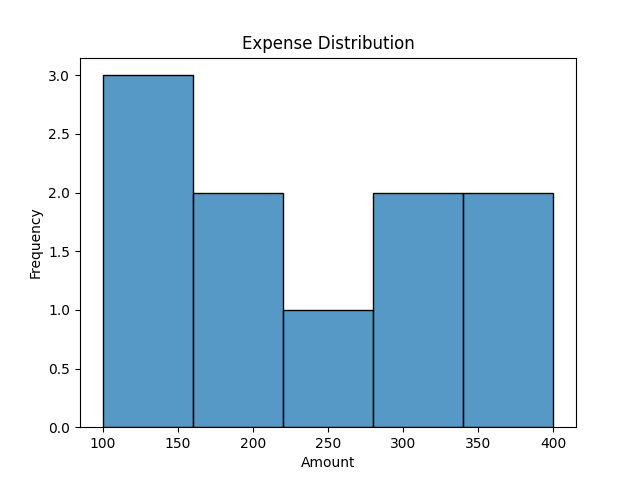
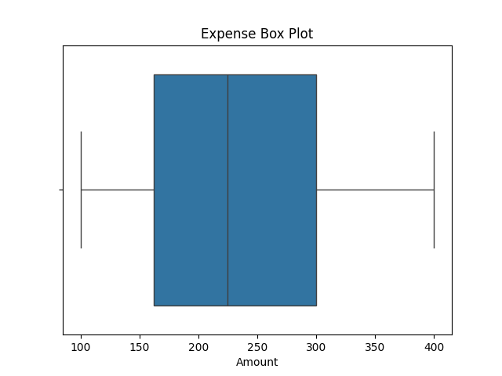

# Seaborn Practice 📊

This repository contains data visualization examples using Seaborn.

---

## 📌 Topics Covered

- Line Plot
- Bar Plot
- Scatter Plot
- Histogram
- Box Plot
- Styled Plots

---

## 📊 Sample Outputs

### Line Plot

### Bar Plot

### Scatter Plot

### Histogram

### Box Plot

### Styled Plot
